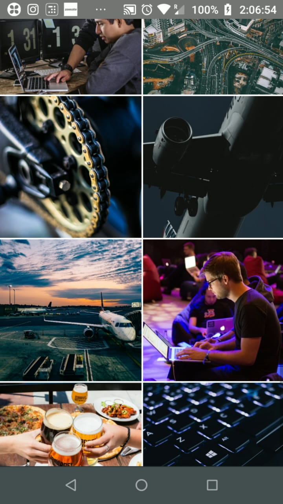

# -YBox-Technologies
Demo assignment with documentation
# Steps to intsall and run the app on device.  
1. Clone or download zip file and run 'npm install' to install node modules in the app.  
2. To run then app after the successfull installation of node modules enter 'npx react-native run-android'
3. I've user react-navigation V-5 here.
4. The redux and all the content is located inside src directory.
5. The size of this app has increased a lot because of the high quality pictures that i've used, i could also have uses uri links to get the images everytime the app opens, but to make the process faster i added them in the local assets directory.  
6. Do let me know if you face any issues(arpitdubey907@gmail.com).  
6. Attached here are the demo screen Capture from the app.  
Splash Screen  
  
Photos Screen  

Followers Screen 

